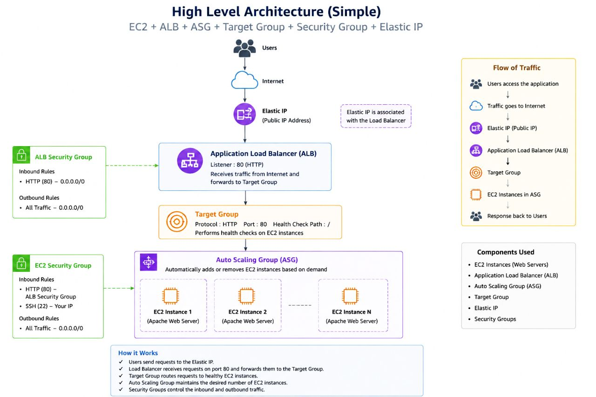
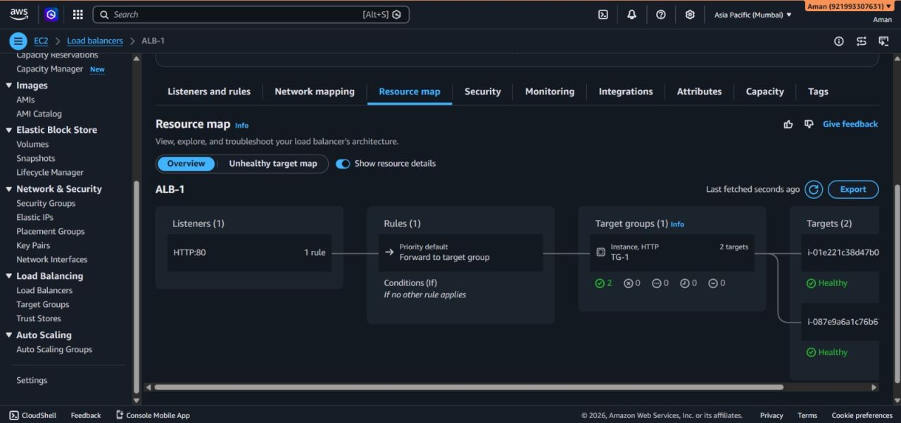
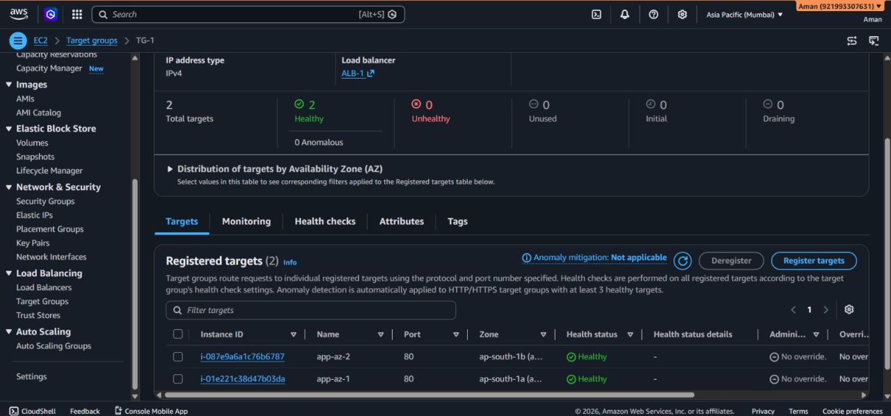
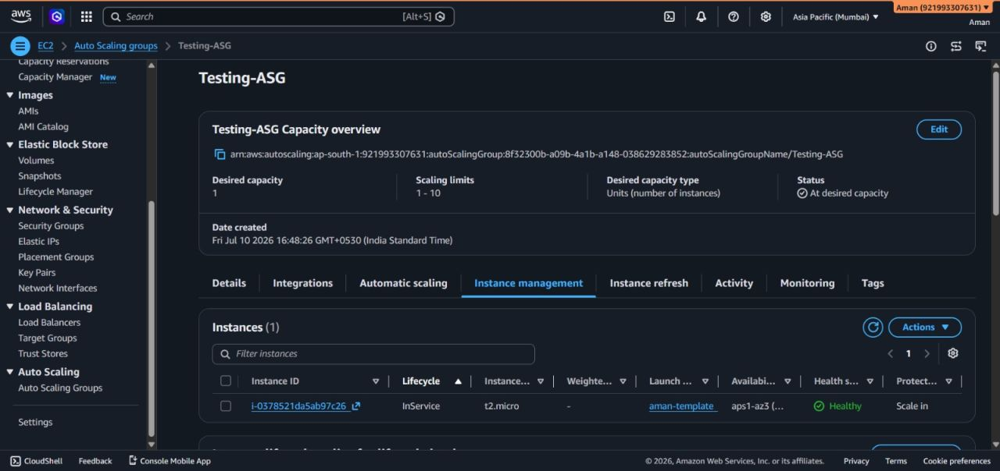
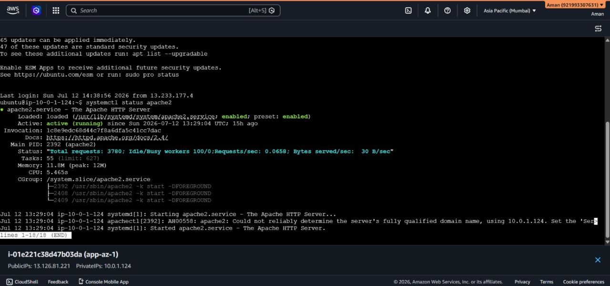
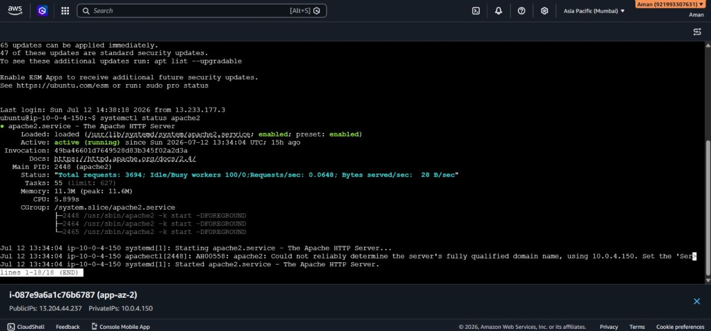
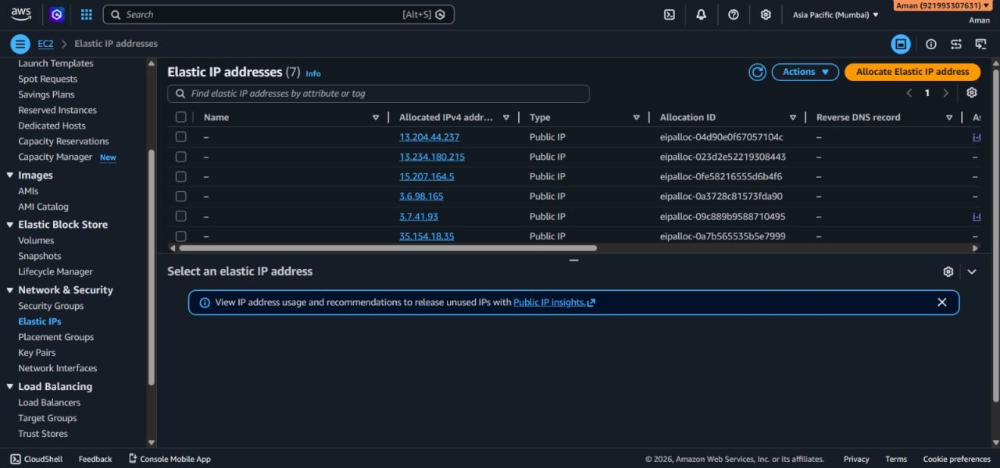

# 🚀 AWS Highly Available Web Application Infrastructure

A hands-on AWS cloud infrastructure project demonstrating the deployment of a highly available and scalable web application using Amazon EC2, Application Load Balancer (ALB), Auto Scaling Group (ASG), Target Groups, Launch Templates, Security Groups, Ubuntu Server, and Apache Web Server.

---

## 📌 Project Overview

The objective of this project was to design and deploy a web application infrastructure that can:

- Distribute incoming traffic across multiple EC2 instances
- Detect unhealthy backend instances using health checks
- Maintain application availability using an Auto Scaling Group
- Automatically manage EC2 instances using a Launch Template
- Secure communication using AWS Security Groups
- Provide a single public endpoint through an Application Load Balancer
- Demonstrate real-world troubleshooting of cloud infrastructure

---

## 🏗️ Architecture



### High-Level Architecture

```text
                         👤 USER
                           │
                           ▼
                       INTERNET
                           │
                           ▼
                ┌─────────────────────┐
                │ Application Load    │
                │ Balancer (ALB)      │
                └──────────┬──────────┘
                           │
                           ▼
                    ┌──────────────┐
                    │ Target Group │
                    └──────┬───────┘
                           │
              ┌────────────┴────────────┐
              │                         │
              ▼                         ▼
       ┌──────────────┐          ┌──────────────┐
       │    EC2 #1    │          │    EC2 #2    │
       │    Apache    │          │    Apache    │
       └──────────────┘          └──────────────┘
              ▲                         ▲
              │                         │
              └───────────┬─────────────┘
                          │
                 Auto Scaling Group
                          │
                   Launch Template

🔄 Complete Request Flow

User
 │
 ▼
Internet
 │
 ▼
Application Load Balancer
 │
 ▼
Target Group
 │
 ├───────────────────┐
 ▼                   ▼
EC2 Instance 1       EC2 Instance 2
 │                   │
 ▼                   ▼
Apache               Apache
 │                   │
 └─────────┬─────────┘
           │
           ▼
        Response
           │
           ▼
Application Load Balancer
           │
           ▼
          User**

Request Processing : 
The user sends an HTTP request.
The request reaches the Application Load Balancer.
The ALB forwards the request to the Target Group.
The Target Group determines which registered instance is healthy.
The request is forwarded to a healthy EC2 instance.
Apache processes the HTTP request.
The response is returned through the ALB to the user.

⚙️ Implementation
1. EC2 Instances

Ubuntu-based EC2 instances were deployed to host the web application.

Apache HTTP Server was installed and configured on the instances.

Different responses were configured on the backend servers to verify that traffic was being distributed across multiple EC2 instances.

Example:

Server 1
Hello from Server 1
Server 2
Hello from Server 2

This made it possible to visually verify which backend instance handled a request.

2. Apache Web Server

Apache was installed on the Ubuntu EC2 instances.

Installation
sudo apt update
sudo apt install apache2 -y
Start Apache
sudo systemctl start apache2
Enable Apache at boot
sudo systemctl enable apache2
Verify Apache status
sudo systemctl status apache2

Apache was configured to serve the application over HTTP port 80.

3. Application Load Balancer

An Internet-facing Application Load Balancer was created to receive incoming HTTP requests.

ALB Configuration
Scheme       : Internet-facing
Protocol     : HTTP
Listener     : Port 80
Forwarding   : Target Group

The ALB acts as the public entry point to the application.

Instead of users directly accessing individual EC2 instances, they access the ALB DNS endpoint.

The ALB then distributes requests to healthy backend instances.

4. Target Group

A Target Group was created to register the EC2 instances behind the Application Load Balancer.

Configuration
Protocol             : HTTP
Port                 : 80
Health Check         : HTTP
Health Check Path    : /

The Target Group continuously performs health checks against the registered EC2 instances.

If an instance becomes unhealthy, the ALB stops routing new requests to that instance.

5. Auto Scaling Group

An Auto Scaling Group was configured to manage the EC2 instances.

The ASG uses a Launch Template to define how new instances should be created.

Responsibilities of ASG
Maintain the desired number of EC2 instances
Launch new instances when required
Replace unhealthy instances
Terminate instances when scaling down
Maintain application availability

The Auto Scaling Group removes the need to manually manage individual EC2 instances.

6. Launch Template

A Launch Template was created to provide a consistent configuration for EC2 instances launched by the Auto Scaling Group.

The configuration includes:

AMI
Instance Type
Key Pair
Security Group
Storage
User Data

The Launch Template allows new EC2 instances to be launched with the required configuration automatically.

🧪 Load Balancing Test

To verify that the ALB was distributing traffic correctly, different
responses were configured on the backend EC2 instances.

Server 1
Hello from Server 1
Server 2
Hello from Server 2

Requests were sent through the ALB DNS endpoint.

The responses demonstrated that requests could reach different backend
instances through the Load Balancer

🛠️ Troubleshooting

During the implementation, Target Group health checks initially required
troubleshooting.

The following areas were investigated:

Apache Service
sudo systemctl status apache2
Apache Port
sudo ss -tulnp | grep :80
Security Groups

Verified that HTTP traffic on port 80 was permitted.

Target Group

Verified:

Target port
Health check protocol
Health check path
Target registration
Target health status
Application Availability

The Apache web server was tested directly on the EC2 instance before
testing the complete ALB → Target Group → EC2 request path.

📚 Key Learning Outcomes

Through this project, I gained practical experience with:

AWS EC2
Application Load Balancer
Target Groups
Auto Scaling Groups
Launch Templates
Security Groups
HTTP health checks
Apache Web Server
Load balancing
High availability
Fault tolerance
Cloud infrastructure troubleshooting
AWS networking concepts
End-to-end request flow

🎯 Why This Architecture?

A single EC2 instance creates a single point of failure.

This architecture improves availability by introducing:

Multiple EC2 Instances
        +
Application Load Balancer
        +
Target Group Health Checks
        +
Auto Scaling Group

If one backend instance becomes unhealthy, the ALB can stop sending new
traffic to it while the Auto Scaling Group can maintain the desired
capacity.

🚀 Future Improvements

The current infrastructure can be extended with:

 HTTPS using AWS Certificate Manager (ACM)
 Route 53 custom domain
 AWS WAF
 CloudWatch monitoring
 CloudWatch alarms
 Private subnets for backend EC2 instances
 NAT Gateway
 Multi-AZ architecture
 CI/CD pipeline
 Infrastructure as Code using Terraform
 Database layer
 Bastion host or AWS Systems Manager Session Manager
 Centralized logging

🧠 Project Architecture Summary

                         USERS
                           │
                           ▼
                       INTERNET
                           │
                           ▼
              ┌────────────────────────┐
              │ Application Load       │
              │ Balancer (ALB)         │
              └───────────┬────────────┘
                          │
                          ▼
                   ┌──────────────┐
                   │ Target Group │
                   └───────┬──────┘
                           │
             ┌─────────────┴─────────────┐
             │                           │
             ▼                           ▼
       ┌────────────┐              ┌────────────┐
       │   EC2 #1   │              │   EC2 #2   │
       │   Apache   │              │   Apache   │
       └────────────┘              └────────────┘
             ▲                           ▲
             │                           │
             └───────────┬───────────────┘
                         │
                  Auto Scaling Group
                         │
                  Launch Template

# 📸 Project Evidence

## 1. Application Load Balancer

The Application Load Balancer receives incoming HTTP requests and distributes them across healthy EC2 instances.



---

## 2. Target Group

The Target Group contains the backend EC2 instances and performs health checks before allowing traffic to reach them.



---

## 3. Auto Scaling Group

The Auto Scaling Group manages the EC2 instances and maintains the desired capacity.



---

## 4. Security Group

Security Groups control the network traffic allowed to the ALB and backend EC2 instances.


---

## 5. Server 1

The first EC2 instance runs Apache Web Server.


---

## 6. Server 2

The second EC2 instance runs Apache Web Server.


---

## 7. Server 1 SSH

SSH was used to configure and troubleshoot the first EC2 instance.



---

## 8. Server 2 SSH

SSH was used to configure and troubleshoot the second EC2 instance.



---

## 9. Elastic IP

Elastic IP configuration used during the infrastructure setup.


---

## 9. Elastic IP

Elastic IP configuration used during the infrastructure setup.

[Elastic IP](Screenshots/Elastic-ip.jpg)
